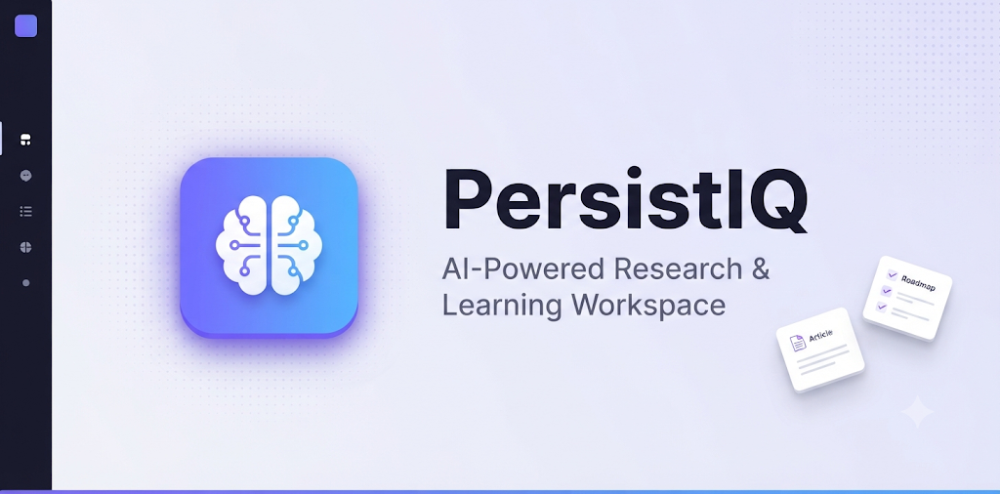

# 

# PersistIQ

*A premium, stateful AI research workspace that constructs deep, comprehensive articles and syllabus roadmaps. Track tasks interactively with complete persistence.*

[](https://persistiq001.onrender.com)
[](#tech-stack)
[](#tech-stack)
[](#tech-stack)
[](#license)

---

## 📋 Table of Contents
- [Features](#-features)
- [Tech Stack](#-tech-stack)
- [Screenshots](#-screenshots)
- [Getting Started](#-getting-started)
- [Environment Variables](#-environment-variables)
- [How to Get API Keys](#-how-to-get-api-keys)
- [Deployment](#-deployment)
- [Team](#-team)
- [License](#-license)

---

## ✨ Features
* 🧠 **AI Article Generator** — Generate multi-page research articles on any topic using Gemini 2.5 Flash with real-time web search.
* 🗺️ **Learning Roadmap Builder** — Create structured day-by-day or week-by-week learning curricula (ranging from 1 day to 4 weeks).
* 🔍 **Live Web Research** — DuckDuckGo-powered real-time search fetches verified sources and links.
* 📄 **PDF Export** — Download beautifully formatted PDFs with a single click, generated entirely in the browser.
* 🔗 **Share Links** — Upload PDFs to Firebase Storage and generate public share links instantly.
* 🔐 **Authentication** — Email/password, Google OAuth, and Guest mode via Firebase Auth.
* 📊 **Progress Tracking** — Mark each roadmap milestone as Todo, Ongoing, or Completed — saved in real-time to Firestore.
* 💾 **Persistent State** — All research tasks and roadmaps are saved per user in Firebase Firestore.

---

## 🛠️ Tech Stack

| Layer | Technology |
|---|---|
| **Frontend** | React 18 + Vite + Tailwind CSS |
| **Authentication** | Firebase Auth (Email, Google, Guest) |
| **Database** | Firebase Firestore |
| **File Storage** | Firebase Storage |
| **AI Engine** | Google Gemini 2.5 Flash API |
| **Web Search** | DuckDuckGo Instant Answer API |
| **PDF Generation** | jsPDF (browser-side) |
| **Deployment** | Render (free tier) |

---

## 📸 Screenshots

<p align="center">
  
  &nbsp;
  
</p>
<p align="center">
  
  &nbsp;
  
</p>

---

## 🚀 Getting Started

### Prerequisites
- Node.js 18+
- npm or yarn
- Firebase project (free Spark plan)
- Google Gemini API key (free at [aistudio.google.com](https://aistudio.google.com))

### Local Setup

```bash
# 1. Clone the repository
git clone https://github.com/yourusername/persistiq.git
cd persistiq

# 2. Install dependencies
npm install

# 3. Create environment file
cp example_env.md .env
# Fill in your keys (see Environment Variables section below)

# 4. Start development server
npm run dev
```

The app will now run locally at [http://localhost:5173](http://localhost:5173).

---

## ⚙️ Environment Variables

Create a `.env` file in the root directory and add the following:

```env
# Firebase (Auth + Firestore + Storage)
VITE_FIREBASE_API_KEY=your_firebase_api_key
VITE_FIREBASE_AUTH_DOMAIN=your_project_id.firebaseapp.com
VITE_FIREBASE_PROJECT_ID=your_project_id
VITE_FIREBASE_STORAGE_BUCKET=your_project_id.appspot.com
VITE_FIREBASE_MESSAGING_SENDER_ID=your_messaging_sender_id
VITE_FIREBASE_APP_ID=your_firebase_app_id

# Gemini AI
VITE_GEMINI_API_KEY=your_gemini_api_key

# Web Search — DuckDuckGo (no key needed)
# Works out of the box, no environment variable required
```

---

## 🔑 How to Get API Keys

### Firebase Setup
1. Go to the [Firebase Console](https://console.firebase.google.com).
2. Create a new project → Add Web App → copy config values.
3. Enable Authentication → Email/Password + Google.
4. Enable Firestore Database → Start in test mode.
5. Enable Storage → Get started.

### Gemini API Key
1. Go to [Google AI Studio API Keys page](https://aistudio.google.com/app/apikey).
2. Sign in → Click **Create API Key** → copy into your `.env` file.

### Web Search
No key needed — DuckDuckGo is used for free real-time search with zero setup.

---

## 🌐 Deployment (Render)

### Method A — Render Dashboard (Recommended)
1. Push your repository to GitHub.
2. Go to [Render](https://render.com) → click **New +** → select **Static Site**.
3. Connect your GitHub repository.
4. Set Build Command: `npm run build`
5. Set Publish Directory: `dist`
6. Add all environment variables from `.env` in the Render dashboard.
7. Click **Deploy**.

### Method B — Auto Deploy
Enable auto-deploy in Render — every push to the `main` branch will deploy automatically.

### Post-Deploy
Go to **Firebase Console** → **Authentication** → **Settings** → **Authorized Domains** → Add your Render URL: `persistiq001.onrender.com`

---

## 👥 Team

| Name | Role |
|---|---|
| **Subhash Boopathi** | Team Leader & Full Stack Developer |
| **Sandhyarani Yarava** | Frontend Developer |
| **ArunKumar R** | Backend & AI Integration |
| **Naveen Kumar S** | UI/UX & Testing |

**Team Name:** Xeno1

---

## 📄 License

```
MIT License

Copyright (c) 2026 Team Xeno1 — PersistIQ

Permission is hereby granted, free of charge, to any person obtaining a copy
of this software to use, copy, modify, merge, publish, distribute without restriction.
```
